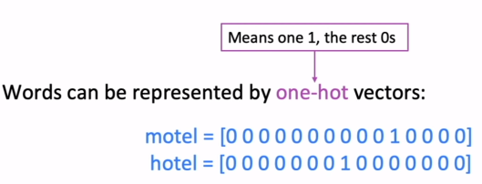
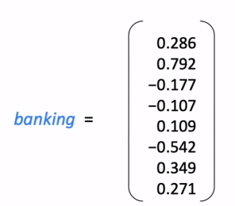
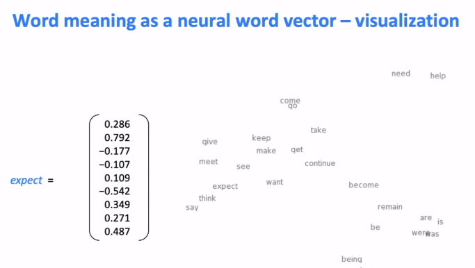
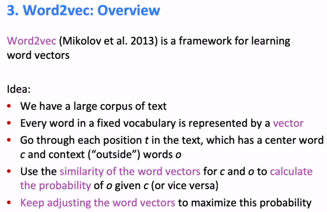
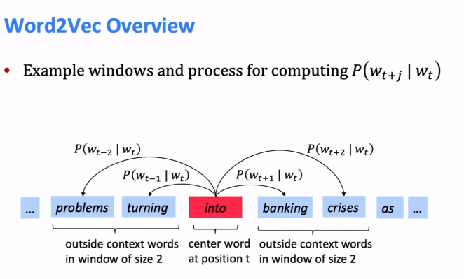
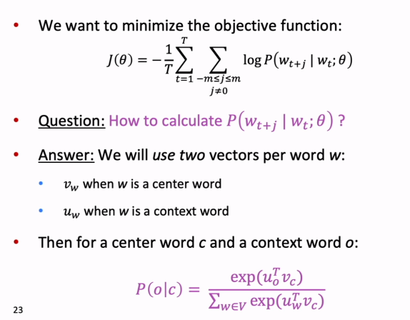
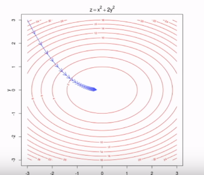
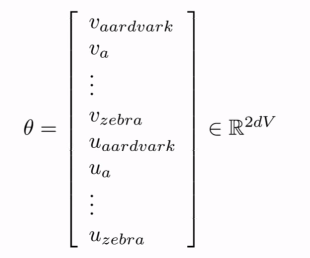

**CS224N笔记（一）：自然语言处理（NLP）简介**

**WordNet（分类词典）的缺点:**

不能准确识别同义词之间的细微差别。

对词语的理解不够精确（单词的词义不能及时更新，WordNet资源也不完整）。

主观性太强（只有固定的离散同义词集）。

耗费大量的人力资源进行标注，来构建 。

难以准确计算字词之间的相似性。

One-hot vectors:

列如：

[猫，狗，鸡，鸭，汽车旅馆，鸟，骆驼，酒店]，对这个数组进行编码之后；

Motel（汽车旅馆）对应的编码应是：

Motel=[0,0,0,0,1,0,0,0];

同理，Hotel(酒店)对应的编码应是：

Hotel=[0,0,0,0,0,0,0,1];

在上面汽车旅馆和酒店的意思是相似，但是对Motel=[0,0,0,0,1,0,0,0]与Hotel=[0,0,0,0,0,0,0,1]内积为0，也就是完全不相关；所以这种方式并不能表示出这种关系。

由于ONE-Hot满足不了相关性，（J.R.Firth）提出了Distributional
semantics(分布式语义):单词的意思，应该结合它的上下文来确定的;现代统计NLP成功的理念之一。

e:

用‘banking’许多的上下文来构建它的意思：

**词向量：**

将选择的每个单词构建了密集的向量，为了更好的预测上下文的意思：

‘banking’对应的维度是8；每一个单词都有一个向量维度，所有单词在一起将会有一个向量空间。

向量中的每个单词具有不同的基础；

Word2vec:是一个学习单词向量的框架。

想法;

我们有大量的文本。

固定词汇表中的每一个单词都由一个向量表示

遍历文本中每一个位置,其中有一个中心词C与外部词O。

用单词的向量的相似性来计算O与C的相同（或想反）的概率。

不断的调整单词向量，使概率值最大化。

用迭代来实现这个算法，要确定一个单词的意思，要结合上下文的意思来确定，我们要遍历文本中的每个位置，通过移动单词向量来实现；重复10亿次之后，得到了好的结果；

计算过程：

目标函数（损失函数或成本函数）：

对于给定的数据集T，固定了窗口的大小（每个面几个字），给定中心单词Wj;

模型的概率

最小化目标函数==最大化概率值；

这个模型中，唯一的一个参数就是我们给定的一个变量；

最小化损失函数；

将每个单词使用俩个向量：当W是中心词是，当W是上下文词时；

然后是中心词C与上下文词O；

e:

定义一个某个单词的上下文模型：

>   P（context\|Wt）=.....

定义损失函数：

>   J=1-P（Wt+j\|Wt）(Wt+j与Wt为上下文)

如果预测结果正确，目标函数为0；

在词料库中的不同位置来训练，调整词向量，最小化目标函数：

比如：我喜欢打篮球，也喜欢打羽毛球。

当出现“打篮球”时，预测出现“打羽毛球”的可能性；概率模型为：

>   P（打羽毛球\|打篮球）（也就是在“打篮球”的条件下“打羽毛球”的概率）

目标函数：

>   J=1-p(W\|打篮球)

如果w=“打羽毛球”，概率为1，目标函数为0。

分子是：通过点积来计算O与C的相似性；分母是对整个词汇表进行标准化后给出的概率分布；

这是一个SOFEMAX函数R\^N——R\^n的例子：

在SOFTMAX函数中：

“max”是将一些大的概率表示为最大的概率Xi;

“soft”是将一些小的概率表示为更小的概率Xj;

经常用于深度学习；

**通过优化训练参数训练模型：**

为了更好的训练模型，调整参数使目标函数最小化；

也就是用梯度下降来找到最优点；

**计算所有向量维度：**

在D维向量与V维向量中，有许多单词：

每个单词都有俩个向量；沿着这个梯度进行优化；
